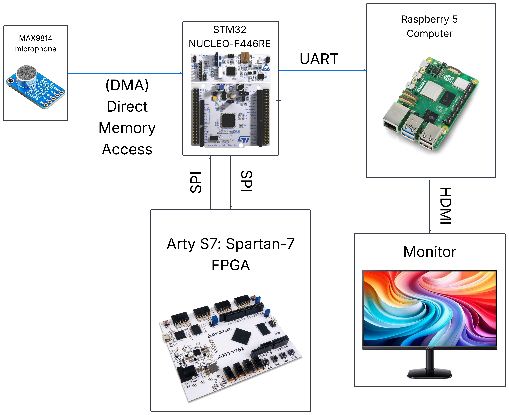

# 🎵 Real-Time Audio Spectrum Analyzer

## 📖 Overview

This project aims to design and implement a real-time audio spectrum analyzer using an embedded system architecture, combining SMT32 microcontroller, FPGA and Rasberry PI computer. 
The STM32 microcontroller is used for real-time data sampling and the process is controlled by FREE RTOS. The STM32 is making a software-based Fast Fourier Transfer (FFT).
The FPGA is used for hardware-accelerated Fast Fourier Transform (FFT) computation. 
The Raspberry Pi is used for visualization and data comparisson.

The primary objective is to demonstrate hardware/software co-design by comparing a software-based FFT implementation running on the STM32 with a hardware-accelerated FFT implemented on the FPGA.

---

## 🎯 Project Objectives

* 🎤 Capture real-time audio from a microphone.
* 🎧 Sample audio using the STM32 Analog-To-Digital Converter.
* 🧮 Perform FFT computation in software using the STM32 (reference implementation).
* ⚡ Design and implement a hardware FFT accelerator on the FPGA.
* 📊 Compare software and hardware FFT performance by Raspberry Pi.
* 📈 Display the frequency spectrum on a screen.
* ✅ Verify the FPGA design.
* ⏱️ Benchmark execution time, latency, and overall system performance.

---

## 🏗️ System Architecture

```text
Microphone
    │
    ▼
STM32 (DMA + FreeRTOS)
    │
    ▼
   SPI
    │
    ▼
   FPGA
(FFT Accelerator)
    │
    ▼
   SPI
    │
    ▼
  STM32
    │
    ▼
   UART
    │
    ▼
Raspberry Pi (GUI)
```
<p align="center">
  
</p>

---

## ✨ Planned Features

* 🎤 Real-time audio acquisition
* 💾 DMA-based buffer management
* ⚙️ FreeRTOS task scheduling
* 🧮 Software FFT (Made on the STM32 ARM)
* ⚡ FPGA-based FFT accelerator
* 🔌 SPI communication between STM32 and FPGA (Back and Forth)
* 🖥️ Raspberry Pi visualization interface 
* 📊 Performance benchmarking (Showed on a monitor)

---

## 🛠️ Hardware (Planned)

* 🔹 STM32 Nucleo-F446RE
* 🔹 FPGA development board (Arty S7: Spartan-7 FPGA)
* 🔹 Raspberry Pi 5 (16 Gb)
* 🔹 Microphone module (MAX9814)
* 🔹 USB connections for development and debugging
* 🔹 Connectors

---

## 💻 Software used

### 🔧 Embedded

* STM32CubeIDE
* STM32CubeMX
* FreeRTOS
* STM32 HAL
* CMSIS-DSP

### ⚡ FPGA

* SystemVerilog
* AMD Vivado

### 🖥️ Raspberry Pi

* Python
* PyQt or PySide
* PyQtGraph
* PySerial

---

## 📂 Repository Structure

```text
visualisation/     Images and videos related to the project
docs/              Project documentation
stm32/             STM32 firmware
fpga/              FPGA source files
verif/             Verification source files for FPGA
raspberry_pi/      GUI and logging software
test_data/         Sample datasets
results/           Benchmarks and experimental results
```

---

## 🚧 Current Status

* [x] 📋 Project planning
* [x] 🏗️ System architecture defined
* [x] 🛒 Hardware selection completed
* [ ] ⚙️ STM32 development environment configured
* [ ] 🎤 Audio acquisition
* [ ] 💾 DMA implementation
* [ ] 🧵 FreeRTOS integration
* [ ] 🧮 Software FFT
* [ ] 🔌 SPI communication
* [ ] ⚡ FPGA FFT implementation
* [ ] 🖥️ Raspberry Pi GUI
* [ ] 🔗 System integration
* [ ] 📊 Performance benchmarking

---

## 🎓 Learning Goals

This project is intended to develop practical experience in:

* 🔹 Embedded systems engineering
* 🔹 Real-time operating systems (FreeRTOS)
* 🔹 FPGA development using SystemVerilog
* 🔹 Digital Signal Processing (DSP)
* 🔹 Hardware/software co-design
* 🔹 Communication protocols (SPI, UART)
* 🔹 Performance optimization and benchmarking

---

## 🚀 Project Status

This repository is currently under active development. The documentation, architecture, and implementation will continue to evolve as the project progresses.

⭐ Feel free to follow the project and check back for updates as new features and milestones are completed.
